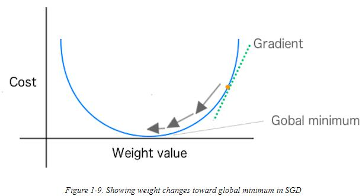

## 1. What is gradient descent ?  
Gradient descent is a technique that is commonly used in machine learning to improve the quality of the network's predictions. Gradient descent
measures the change in the  error (slope) caused by changing the network's parameters and modifies them such as to move them one step to the bottom of the valley. It does so by taking the derivative of the loss function to produce the gradient which gives the direction for the next step (@DeepLearning).



## 2. Why do we need to use gradient descent in linear regression?
As gradient descent is an optimization algorithm, it is used in linear regression to minimize the error by calculating (and consequently, adjusting) the coefficients used in a linear regression model (@LinearRegression).

## 3. What is a cost function?
It measures the performance of a Machine learning model. In which cost  quantifies the error between predicted values and expected values. It is represented as a single real number (@CostFunction).

## 4. Which is the cost function for a linear regression?

The cost function in a linear regression model is called mean sqared error because it's the difference between the estimated value and the real value and the result of that is squared and divided by the number of values (@LinearRegression2)

## 5. How do we maximize the 𝛽 parameters from the cost function? Mathematical procedure to get the update equation from the cost equations

First in the cost funtion we have to replace the estimated value for the hypothesis of the linear regresion that is y=mx+b, in which m and b are our 𝛽 parameters to be optimized.


After that in order to optimize we have to do the partial derivates of the funtion with m and b.


Those functions will be used to update. (@LinearRegression2)

## 6. What is a convergence test?

A convergence tests are methods with which you can test if your function is converging or diverging, if the series is diverging the test should be a positive real number, and if the series should tend to diverge then the test should tend to infinity

## 7. Code the linear regression cost function and the update equations. DO NOT COPY IT FROM INTERNET

Select and plot a data set sample.

```{r}

library(vcd)
dataset = read.csv("dataset.csv")
summary(dataset)
head(dataset)
plot(dataset)


```

Calculate and visualize the linear model given by lm() function.

```{r}
model = lm(y ~ x,data = dataset)
summary(model)
plot(dataset)
abline(model, col = "red")
```

### Cost function

```{r}

cost_function <- function(data, linear_model) {
  x <- data$x
  y <- data$y
  b <- linear_model
  
  mse <- 0
  
  for(i in 1:length(x)){
    mse <- mse + ( y[i] - ( b[2]*x[i] + b[1] ) ) ^ 2
  }

  mse <- mse / length(x)

  return(mse)
}

linear_model = c(model$coefficients[1], model$coefficients[2])
#plot(dataset)
#abline(linear_model)
mse = cost_function(dataset, linear_model)
print(mse)

```

The cost function used is MSE (Mean Square Error). With the linear model (`r model$coefficients[1]`, `r model$coefficients[2]`) provided by lm() R function the cost function error has the following value: `r mse`.


### Update equation (gradient descent)

```{r}

update_equation <- function(data, linear_model, d_update) {
  x <- data$x
  y <- data$y
  b <- linear_model
  
  #mx + b where b2 = m and b1 = b
  d_b2 <- 0
  d_b1 <- 0
  
  for(i in 1:length(x)){
    d_b2 <- d_b2 - 2 * x[i]*( y[i] - (b[2]*x[i]+b[1]) )
    d_b1 <- d_b1 - 2 * ( y[i] - (b[2]*x[i]+b[1]) )
  }

  d_b2 <- d_b2 / length(x)
  d_b1 <- d_b1 / length(x)
  
  #print(d_b2)
  #print(d_b1)
  
  n_b2 <- b[2] - d_b2*d_update
  n_b1 <- b[1] - d_b1*d_update
  
  #print(n_b2)

  return(c(n_b1, n_b2))
}

plot(dataset)
abline(model, col = "red")
cost_function_hist = c()

linear_model = c(-35, 3)
initial_linear_model = linear_model

iterations = 100

for (i in 1:iterations) {
  linear_model = update_equation(dataset, linear_model, 0.001)
  #abline(linear_model, col = "blue")
  cost_function_hist <- c(cost_function_hist, cost_function(dataset, linear_model))
}

abline(linear_model, col = "blue")
plot(cost_function_hist, xlab = "iterations", ylab = "cost_function", type = "l", col = "red")

```

By updating a linear model like (`r initial_linear_model`) and by performing `r iterations` iterations; the model was finally updated to (`r linear_model`). With a cost function error of `r cost_function_hist[length(cost_function_hist)]`.


# References

<div id="refs"></div>

